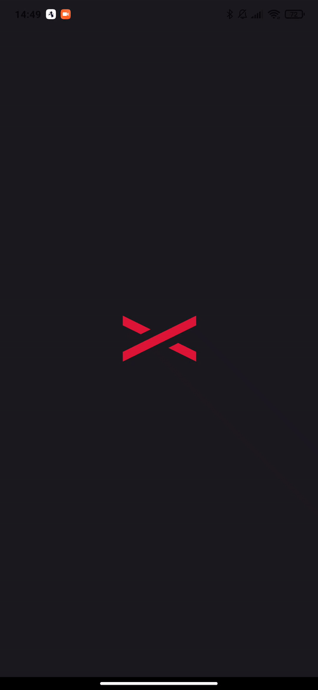

# RentX

Mobile app for car rental

## Stacks

**Front-end:** React Native, Styled Components

**Back-end:** Json Server (fake API)

## Features

- Car listing
- Cars details
- Slider images
- Schedule rent
- My scheduled rentals
- Animated Splash screen
- Animated floating button
- Animated load image

## Run

Install this project with yarn and expo

```bash
  yarn
```

in another terminal

```bash
  yarn api
```

```bash
  expo start
```

## Demo

<p aling="center">
  
</p>
